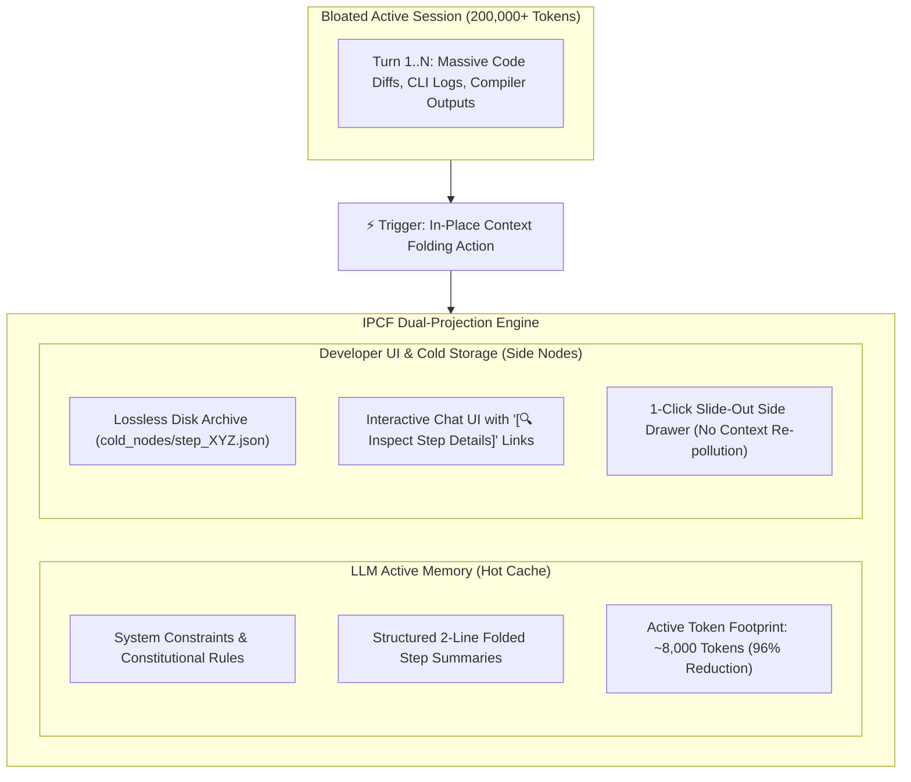

# ContextFold — In-Place Context Folding Specification (IPCF-1.0)
### A Virtual Memory Paging Architecture for Long-Horizon Agentic LLM Conversations

[](https://opensource.org/licenses/MIT)
[]()
[]()

**Author:** Mustafa KILINC ([@mrblackman](https://github.com/mrblackman))  
**Initial Release:** September 2026  
**Document ID:** `RFC-IPCF-001`  
**Repository:** [github.com/mrblackman/ContextFold](https://github.com/mrblackman/ContextFold)  

---

## 🎯 1. Executive Summary

Modern AI coding assistants (such as Google Antigravity, Cursor, Windsurf, Claude Code, and GitHub Copilot) routinely hit 150,000–250,000+ tokens during extended engineering sessions. 

While Large Language Models (LLMs) boast theoretical context windows of 1M+ tokens, empirical benchmarks (Stanford's *Lost in the Middle*, Chroma's *MECW*, RULER) establish that **multi-step agentic reasoning degrades precipitously past 60,000–80,000 tokens ("Context Rot")**.

Today's developer is trapped in a painful dichotomy:
1. **Abandon the Chat:** Manually migrate to a new chat session, forfeiting immediate visual continuity, scroll history, and cognitive scratchpad memory.
2. **Endure Degradation:** Remain in the bloated session, suffering from agonizing Time-To-First-Token (TTFT) latency, massive per-turn compute waste, and hallucination loops.

**The In-Place Context Folding Specification (IPCF)** resolves this dilemma by adapting the proven computer science paradigm of **Virtual Memory Paging** to LLM conversation management. IPCF compresses active LLM prompt context by **96% (from 200k to ~8k tokens)** while preserving **100% of historical detail in zero-loss, interactive side drawers.**

---

## 💥 2. The Core Problem: Why Existing Solutions Fail

```text
Bloated Session (200k+ Tokens)
   │
   ├── Naive FIFO Truncation ──► Discards early system prompts & architectural rules (Hallucination Cascade)
   ├── Full Chat Restart      ──► Breaks cognitive flow & destroys developer scratchpad diary (High Friction)
   └── Infinite Context Growth ──► Attention dilution, 15-second TTFT latency, exponential compute drain
```

1. **Passive FIFO Truncation Breaks Architecture:** Blindly dropping older turns causes the model to forget core architectural rules, entity relationships, and security constraints established at the beginning of the conversation.
2. **The "Fresh Chat" Friction Barrier:** Developers actively resist opening new chats because reconstructing 50 turns of decisions and modified files takes minutes of manual recap.
3. **Verbose Tool Output Pollution:** 70–85% of accumulated tokens in a typical agentic coding session consist of redundant compiler outputs, package manager logs, and full-file dumps that are never referenced again.

---

## 🏛️ 3. Architecture: The Dual-Projection Model

IPCF introduces a **Dual-Projection Architecture**, decoupling the representation of conversation history seen by the **LLM** from the representation displayed to the **Developer**.



### 3.1. Projection A: The LLM Working Memory (Hot Cache)
The model receives an ultra-lean prompt consisting strictly of:
1. Core System Prompt & Architectural Constraints.
2. A chronological chain of **Structured Folded Step Summaries** (strictly schema-enforced).
3. The current active turn.

**Average prompt size drops from 200,000+ tokens to under 8,500 tokens.**

### 3.2. Projection B: The Developer Interface (Cold Storage View)
The human developer sees an unbroken, coherent conversation:
* In the chat stream, verbose historical turns collapse into elegant, compact summary cards.
* Adjacent to each summary card, an interactive button appears: **`[🔍 Inspect Details (Step 42)]`**.
* Clicking this button opens a non-intrusive **Slide-Out Side Drawer** (or modal), rendering the verbatim original diffs, terminal streams, and compiler logs.
* **Crucially:** Opening and reading raw history in the UI does **NOT** inject those tokens back into the LLM's active prompt.

---

## 🛠️ 4. Formal Specifications

### 4.1. Folded Step Summary Schema (LLM View)
When an agent folds conversation history, each turn MUST be transformed into a deterministic, structured schema to prevent semantic drift:

```yaml
step_id: 42
timestamp: "2026-09-25T11:42:00Z"
target_files:
  - "src/Core/Middleware/TenantResolutionMiddleware.cs"
action_type: "CODE_MODIFICATION"
summary: "Implemented cookie-based fallback for multi-tenant resolution during dev tunnel routing."
status: "SUCCESS"
artifacts:
  cold_node_ref: "cold_nodes/step_42.json"
```

### 4.2. Cold Node Schema (Disk Storage)
Raw payload data is written to disk in a decoupled, atomic JSON record:

```json
{
  "$schema": "https://json-spec.org/ipcf/v1/cold-node.json",
  "step_id": 42,
  "session_id": "02da1efb-b376-486f-a0ab-bbf925eedada",
  "original_prompt": "Fix tenant resolution when running over cloudflared tunnel",
  "raw_tool_calls": [
    {
      "tool": "run_command",
      "command": "dotnet test --filter TenantResolutionTests",
      "exit_code": 0,
      "stdout": "Passed! - Failed: 0, Passed: 14, Skipped: 0"
    }
  ],
  "code_diffs": [
    {
      "file": "src/Core/Middleware/TenantResolutionMiddleware.cs",
      "diff": "@@ -24,4 +24,12 @@ if (context.Request.Cookies.TryGetValue(...))"
    }
  ],
  "sanitized": true
}
```

### 4.3. On-Demand Memory Hydration Tool (`fetch_archived_node`)
When the developer asks a backward-looking question requiring verbatim historical parameters (e.g., *"What was the exact port number from that Docker error 60 steps ago?"*), the agent MUST NOT guess or hallucinate. 

Instead, the agent invokes a standardized tool:

```typescript
interface FetchArchivedNode {
  name: "fetch_archived_node";
  description: "Transiently inspects the verbatim payload of a cold historical step without permanently re-polluting active context.";
  parameters: {
    step_id: number;
    target_field?: "stdout" | "code_diffs" | "raw_tool_calls";
  };
}
```
* **Execution Boundary:** The returned payload is visible **only during the active turn** and is discarded from the LLM prompt on the subsequent turn, strictly preventing context re-bloating.

---

## 🛡️ 5. Security & Red Team Considerations

During the architectural stress test conducted by our Red Team, three critical vulnerabilities were mitigated:

### 5.1. Secret Sanitization in Cold Storage
* **Vulnerability:** Unsanitized terminal streams frequently contain bearer tokens, `.env` parameters, or database connection strings. Moving raw history to disk files creates an unencrypted treasure trove.
* **Mandate:** All payloads written to `cold_nodes/` MUST pass through an automated regex sanitization filter (redacting `Bearer`, `sk_live_`, passwords, and private keys) prior to serialization.

### 5.2. Semantic Loss Prevention (Anti-Hallucination Guardrail)
* **Vulnerability:** Unconstrained LLMs writing natural-language summaries frequently omit critical parameters (e.g., regex patterns, exact error numbers).
* **Mandate:** Summaries must be validated against the rigid YAML/JSON schema defined in Section 4.1. Vague summaries like *"Fixed stuff"* are rejected and re-generated.

### 5.3. Single-Turn Tool Hydration
* **Vulnerability:** If an agent repeatedly calls `fetch_archived_node` and retains the output, token count spikes back to 200k.
* **Mandate:** Cold node contents are treated as ephemeral scratchpad data with zero prompt persistence across turns.

---

## 📊 6. Comparison: IPCF vs. State-of-the-Art

| Feature / Metric | Naive LLM Session | Blind FIFO Pruning | Full Session Reset | **IPCF (This Spec)** |
| :--- | :--- | :--- | :--- | :--- |
| **Active Prompt Tokens** | 150k – 250k+ | 30k – 60k | ~2,500 | **~8,000 (96% Reduction)** |
| **TTFT Latency** | 8 – 20 seconds | 3 – 8 seconds | < 1 second | **< 1.5 seconds** |
| **Conversational Continuity** | Complete | Degraded | Broken | **100% Preserved** |
| **Historical Log Access** | Messy scrolling | Lost forever | Lost to archive | **1-Click Side Drawer** |
| **Domain Constraint Fidelity** | Fails (Lost in Middle)| Fails (Truncated) | High | **100% Locked & Retained** |
| **Developer Overhead** | Low | Low | High (Manual Recap)| **Zero (Single Action)** |

---

## 🌐 7. Platform Implementations & Ecosystem Adoption

The IPCF specification is intentionally **vendor-agnostic**. It is designed for seamless adoption across:

* **Google Antigravity:** Native integration with `/btw` side-panel drawer infrastructure.
* **Cursor & Windsurf:** Collapsible timeline widgets embedded inside the composer.
* **Claude Code & Terminal Agents:** Terminal pager offloading (stashing raw logs in `.claude/nodes/`).
* **Continue.dev & Open Source Agents:** Native client-side state managers with local storage nodes.

---

## 📜 8. License & Attribution

This specification is released under the **[MIT License](LICENSE)**. 

It is free for public use, adaptation, and commercial integration by any IDE, AI agent vendor, or developer tooling organization. When adopting or referencing this architecture, please cite:

```bibtex
@misc{kilinc2026contextfold,
  author = {Mustafa KILINC (@mrblackman)},
  title = {ContextFold: In-Place Context Folding Specification (IPCF-1.0) - Virtual Memory Paging for Long-Horizon Agentic LLM Conversations},
  year = {2026},
  publisher = {GitHub},
  howpublished = {\url{https://github.com/mrblackman/ContextFold}}
}
```
