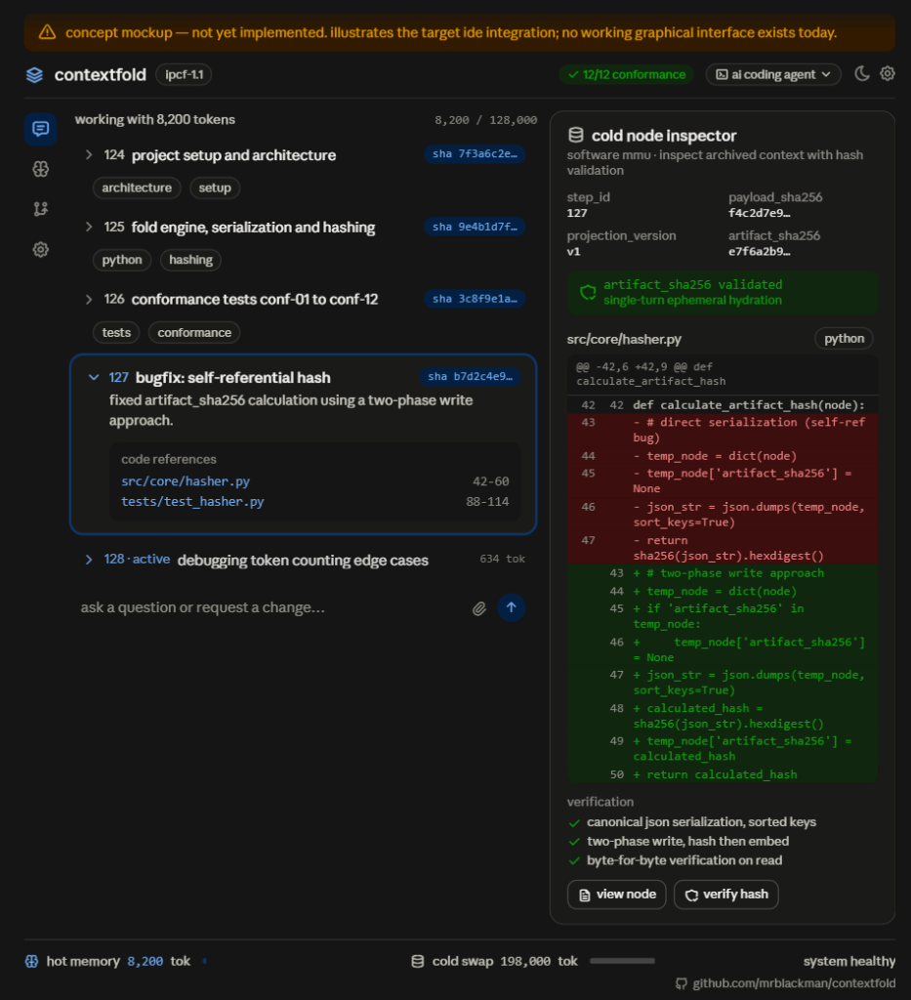
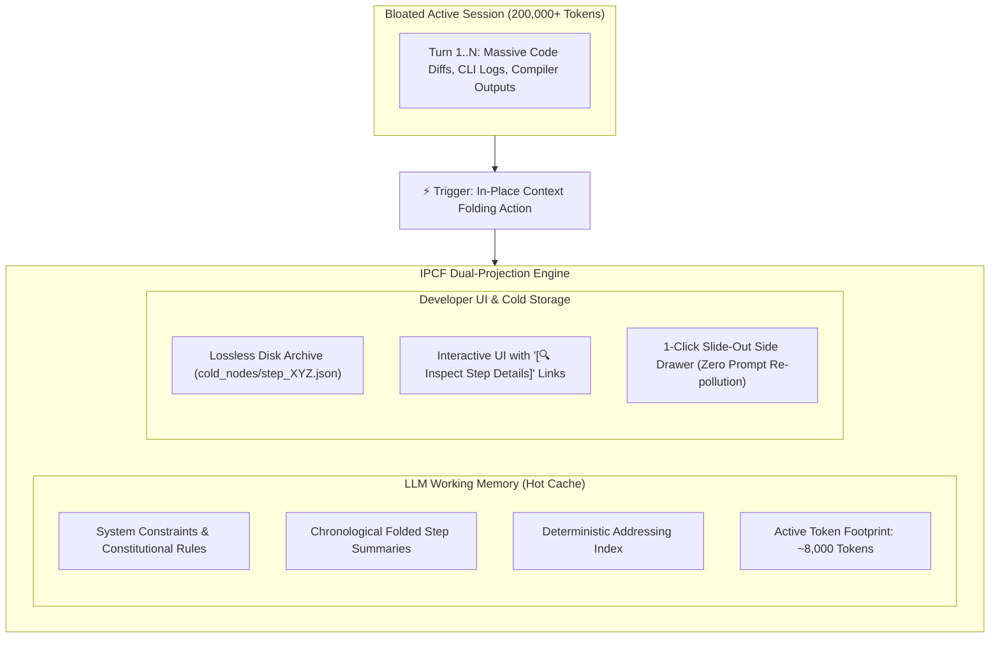
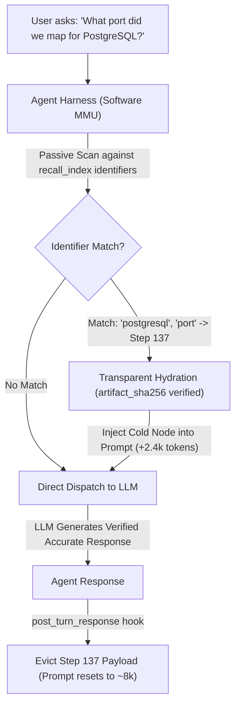

# ContextFold — In-Place Context Folding Protocol (IPCF-1.1)
### A Virtual Memory Paging Architecture for Long-Horizon Agentic LLM Sessions

> **IPCF** — *In-Place Context Folding Protocol*: a vendor-neutral open specification for lossless, deterministic in-session context paging for long-horizon AI agent conversations.

[](https://opensource.org/licenses/MIT)
[](schemas/)
[](contextfold.py)
[](CONFORMANCE.md)

**Author:** Mustafa KILINC ([@mrblackman](https://github.com/mrblackman))  
**Version:** IPCF-1.1 (Normative Protocol Specification)  
**Document ID:** `RFC-IPCF-001`  
**Repository:** [github.com/mrblackman/ContextFold](https://github.com/mrblackman/ContextFold)  

---

> 💡 **Core Axioms:**  
> *"Fold changes what the model carries."*  
> *"Fork changes where the model continues."*  
> *"Don't make the AI carry what the machine can page."*  
> *"Don't ask the AI to remember what the machine can retrieve."*

> ⚠️ **Specification Status: RFC Draft — Under Active Development**  
> This repository defines an open, vendor-neutral protocol. The accompanying `contextfold.py` is a **reference implementation** that demonstrates the method is buildable — it is not a production-ready tool. The conformance test suite (`CONFORMANCE.md`) defines the normative requirements any compliant implementation must satisfy. We welcome architectural feedback, peer review, and independent implementations.

---

## 🔌 0. Runtime Assumptions & Integration Surface

IPCF is engineered specifically for **active Agent Harnesses and IDE Runtimes** (such as Google Antigravity, Claude Code, Cursor, Windsurf, Aider, and custom agent loops) that programmatically assemble and manage the LLM's message array and prompt context on every conversational turn.

> ⚠️ **Non-Applicability to Passive Web Chats:**  
> IPCF **CANNOT** run inside standard consumer web chat interfaces (such as vanilla ChatGPT or Claude.ai web UIs) where the server-side platform owns transcript persistence and appends messages monolithically without client-side memory control.

### Required Harness Capabilities:
To implement IPCF, a hosting agent harness MUST support:
1. **Dynamic Context Window Assembly:** The ability to inject ephemeral system or user messages into the active prompt payload *before* dispatching to the LLM.
2. **Turn-Level Lifecycle Hooks:**
   - `pre_turn_dispatch`: Intercept incoming user prompt, passively scan identifiers against `recall_index.json`, and hydrate matching cold nodes.
   - `post_turn_response`: Execute single-turn prompt eviction (`CONF-07`), pruning hydrated nodes back down to baseline working memory before the subsequent turn.

> 🎨 **Concept mockup — not a screenshot.** This image illustrates the target IDE integration described in [§0 Runtime Assumptions & Integration Surface](#-0-runtime-assumptions--integration-surface). No graphical implementation exists yet — `contextfold.py` is a terminal-only reference CLI (see [§7](#-7-reference-implementation-contextfoldpy)). The UI shown here is a design goal, not a working feature.



---

## 🎯 1. Executive Summary

Modern AI coding assistants routinely reach 150,000–250,000+ tokens during extended engineering sessions. While Large Language Models advertise theoretical context windows of 1M+ tokens, empirical research (Stanford's *Lost in the Middle*, Chroma's *MECW*, RULER) establishes that **multi-step agentic reasoning degrades past 60,000–80,000 tokens ("Context Rot")**.

Today's developer is trapped in a painful dichotomy:
1. **Abandon the Session (New Chat):** Manually migrate, forfeiting visual continuity, scroll history, and cognitive scratchpad memory.
2. **Endure Context Degradation:** Remain in the bloated session, suffering severe Time-To-First-Token (TTFT) latency, per-turn compute waste, and attention dilution loops.

**ContextFold (IPCF-1.1)** resolves this dilemma by adapting the proven computer science paradigm of **Virtual Memory Paging** to active LLM conversation runtimes. Unlike summarization tools that discard raw history, ContextFold operates an **In-Place Dual-Projection Architecture** that keeps the developer in the same session while decoupling active prompt context from archival disk storage.

---

## ⚖️ 2. The Four Invariants of IPCF-1.1

Any compliant implementation MUST enforce four non-negotiable architectural invariants:

```text
┌────────────────────────────────────────────────────────────────────────┐
│                   THE 4 INVARIANTS OF IPCF-1.1                         │
├────────────────────────┬───────────────────────────────────────────────┤
│ 1. Lossless Storage    │ Folded turns are NEVER deleted from disk.     │
│ 2. Deterministic Fold  │ Same turn + same policy = identical fold.     │
│ 3. Exact Retrieval     │ Recalled data is SHA-256 verified bytes.      │
│ 4. Bounded Rehydration │ Recalled nodes MUST evict after response.     │
└────────────────────────┴───────────────────────────────────────────────┘
```

1. **Lossless Storage:** Moving data out of the active prompt does NOT mean discarding it. All historical turns exist permanently on disk.
2. **Deterministic Folding:** The transformation of raw tool logs into folded summary schema is strictly rule-bound and reproducible — same input always produces the same output.
3. **Exact Retrieval:** Historical information is not re-hallucinated; it is fetched directly from the verifiable cold storage file.
4. **Bounded Rehydration:** Recalled nodes exist in the prompt strictly for the turn in which they are inspected (`scope: single_turn`). They are automatically evicted on the subsequent turn, preventing context re-bloating (`8k → 13k → 8k`).

### What is Deterministic, What is Not?

To avoid conceptual ambiguity, IPCF draws a strict boundary between semantic interpretation and deterministic protocol execution:

* **Semantic / Non-Deterministic Input:** Generating a high-level summary from verbose compiler outputs, test suites, or raw terminal dumps is an inherently semantic task (performed by an LLM or human engineer). IPCF does NOT claim that natural language summarization is mathematically deterministic.
* **Deterministic / Verifiable Protocol:** Once a summary and raw payload are provided to the fold engine, the entire lifecycle — canonical projection ordering, keyword identifier extraction, indexing, SHA-256 verification (`projection_sha256`, `artifact_sha256`), filesystem persistence, and hydration — is **100% deterministic and mathematically reproducible** across platforms (CONF-11).

---

## 🏛️ 3. Architecture: The Dual-Projection Model

IPCF decouples the conversation representation seen by the **LLM** from the representation displayed to the **Developer**:



### Virtual Memory Analogy

| Operating System Paradigm | ContextFold (IPCF-1.1) Equivalent |
| :--- | :--- |
| **Physical RAM** | Active LLM Prompt Context (Hot Cache: ~8,000 tokens) |
| **Disk Storage / Swap** | Lossless Cold Storage Archive (`cold_nodes/step_XYZ.json`) |
| **Page-Out (Swap Out)** | `fold_turn()`: Compress verbose logs into schema summary on disk |
| **Page-In (Swap In)** | `fetch_archived_node()`: On-demand single-turn rehydration |
| **Memory Address Bus / MMU** | Deterministic Addressing Layer + **Passive Recall Interception** |
| **Page Fault** | User or agent touches a concept archived in cold storage |
| **Page Eviction** | Automated pruning of hydrated node on the next turn |

---

## 🔍 4. Deterministic Historical Addressing Layer

### The Meta-Cognition Problem: Why Pull-Based Recall Fails
If an architecture expects the LLM to realize *"I do not remember the Docker port from 200 turns ago, so I will invoke `recall_archived_nodes('PostgreSQL')`"*, it fails in practice.
LLMs suffer from severe **meta-cognitive blind spots**: models rarely detect their own lack of knowledge; instead of issuing a pull-based tool call, they confidently hallucinate plausible parameters.

### The Breakthrough: Push-Based Passive Recall (The Software MMU Pattern)
In modern operating systems, virtual memory paging is **push-based and transparent**: the CPU does not ask the OS to load a missing page; the Memory Management Unit (MMU) traps the memory address access, loads the page from disk, and presents it to the process invisibly.

IPCF-1.1 introduces the **Software MMU Pattern** (`CONF-13 Candidate`):
1. **Passive Interception:** On every turn (`pre_turn_dispatch`), the Agent Harness passively scans the user prompt and working state against the set of `identifiers` indexed in `recall_index.json`.
2. **Transparent Page-In:** If a keyword or symbol matches, the harness **automatically hydrates** the candidate cold node into the active prompt *before* the LLM generates tokens.
3. **Zero Meta-Cognitive Burden:** The LLM does not need to know that it had forgotten the parameter; the verified ground truth is already on its desk.
4. **Single-Turn Eviction:** Following generation, the paged-in node is evicted (`post_turn_response`), ensuring the active prompt resets to baseline (~8k tokens).



### Multi-Dimensional Recall Index Structure
IPCF-1.1 specifies a **Deterministic Historical Addressing Layer** conforming to [`recall_index.schema.json`](schemas/recall_index.schema.json). During folding, machine parsing extracts an inverted index of structural entities:

```json
{
  "step_id": 137,
  "folded_at": "2026-09-25T11:42:00Z",
  "identifiers": ["5433", "postgres_db", "monofina_dev"],
  "payload_sha256":    "a3f2...c91b",
  "projection_sha256": "7e4d...82fa",
  "artifact_sha256":   "b901...44cc"
}
```

### Keyword-Based vs. Semantic Recall Trade-Off
* **Reference Implementation Choice:** `contextfold.py` employs exact-token and keyword-normalized matching (`_extract_identifiers`). This preserves the **Zero External Dependencies** mandate (pure Python standard library, no torch, no numpy, no vector DB).
* **The Trade-Off:** Keyword matching is fast, zero-cost, and strictly deterministic, but vulnerable to synonyms or paraphrased queries.
* **Production Extension Path:** Production harnesses (IDE plugins, enterprise agents) are explicitly encouraged to extend the recall index with local vector embeddings or hybrid BM25 + dense retrieval without altering the cold storage or SHA-256 verification contracts.

---

## 📏 5. Three Hash Identities (CONFORMANCE.md §2)

Every folded artifact carries three distinct hash identities, each answering a different question:

```text
                ContextFold Identity Model
                          │
         ┌────────────────┬────────────────┐
         │                │                │
   payload_sha256   projection_sha256   artifact_sha256
         │                │                │
   "What arrived?"  "What was produced?"  "How is it stored?"
         │                │                │
      CONF-02          CONF-11           CONF-09
    Round-Trip       Deterministic        Tamper
                       Replay            Detection
```

| Identity | Computed From | Changes When? |
| :--- | :--- | :--- |
| `payload_sha256` | Raw source content (UTF-8) | Never — immutable |
| `projection_sha256` | Canonical fields in fixed order (step_id, normalized_content, sorted identifiers) | Projection algorithm changes |
| `artifact_sha256` | Full serialized cold node file | Serialization format changes |

---

## 🧪 6. The 500-Turn Verification Scenario

To demonstrate IPCF-1.1, consider a long-running 500-turn refactoring session:

* **Turn 37:** PostgreSQL container mapped to host port `5433`.
* **Turn 91:** Port switched to `5434` (conflict resolution).
* **Turn 137:** Port reverted to `5433`.
* **Turn 318:** Migration script `V12__TenantBilling.sql` applied.

```text
At Turn 490, developer asks:
"What port are we using for PostgreSQL, and which migration applied the billing table?"

Without ContextFold:
- Context is at 230,000 tokens. Severe attention dilution, high hallucination.

With ContextFold:
1. Active prompt is at 8,200 tokens.
2. Harness Software MMU scans user query: matches ['postgresql', 'port'] -> Step 137 (latest chronological), Step 91, Step 37.
3. Harness transparently hydrates Step 137 (SHA-256 verified) before model execution.
4. Model generates exact, verified response in 1.1s.
5. Post-turn hook evicts Step 137 payload. Active prompt returns to 8,200 tokens.
```

> **The key insight:** The model does NOT carry 500 turns of baggage. But when needed, it retrieves the verified truth instantly — without hallucination.

---

## 💻 7. Reference Implementation (`contextfold.py`)

ContextFold provides an official reference CLI written in pure Python 3.10+ standard library, demonstrating that the IPCF method is buildable with zero external dependencies.

> **Scope Note:** `contextfold.py` is a **reference implementation** — its purpose is to demonstrate protocol feasibility and serve as a specification artifact, not to be production-hardened. Independent implementations by IDE vendors and agent harness teams are explicitly encouraged.

```bash
# Archive a turn into cold storage
python contextfold.py fold 42 "PostgreSQL configured on port 5433"

# Passively scan user prompt against recall index (Software MMU pattern)
python contextfold.py scan "What port did we set for PostgreSQL?"

# Query archived nodes explicitly
python contextfold.py recall "PostgreSQL port"

# Hydrate a cold node into active prompt (SHA-256 verified)
python contextfold.py hydrate 42

# Evict after LLM response (CONF-07)
python contextfold.py evict 42

# Show session status
python contextfold.py status

# Run integrity check on all cold nodes
python contextfold.py validate

# Run 500-turn simulation
python contextfold.py demo
```

---

## 📐 8. Formal Protocol Schemas (`schemas/`)

| Schema File | Purpose |
| :--- | :--- |
| **[`cold_node.schema.json`](schemas/cold_node.schema.json)** | Validates the cold storage payload including all three hash identities. |
| **[`recall_index.schema.json`](schemas/recall_index.schema.json)** | Validates the Deterministic Historical Addressing Layer (dict keyed by step_id). |
| **[`folded_step.schema.json`](schemas/folded_step.schema.json)** | Validates the lean structured folded step summary retained in active prompt. |
| **[`hydration_policy.schema.json`](schemas/hydration_policy.schema.json)** | Enforces bounded single-turn rehydration and automatic prompt eviction. |

---

## 🧭 9. The Architecture: Agent Context System (ACS)

ContextFold forms the memory management tier of the **Agent Context System**:

```text
                         AGENT CONTEXT SYSTEM (ACS)
                                         │
                 ┌───────────────────────┴───────────────────────┐
                 ▼                                               ▼
          [RUNTIME LAYER]                                [WORKSPACE LAYER]
                 │                                               │
        ┌────────┴────────┐                                      ▼
        ▼                 ▼                                [ACQUISITION]
  ContextFold        ContextFork                           git-grep-first
 (Memory Paging)   (Session Handoff)                       (Search Policy)
  • Same Session    • Cross Session                        • Zero token bloat
  • Hot/Cold split  • 6-part verifiable handoff            • Native git grep
  • Recall index    • Evidence & Git state                 • Anti-Select-String
  • Auto-eviction   • Role-based context shaping
```

---

## 🛡️ 10. Security Design Notes

1. **Secret Scrubbing Prior to Serialization:** Raw terminal streams may contain API tokens or database passwords. All payloads written to `cold_nodes/` MUST pass through regex redaction before setting `sanitized: true`. The reference implementation sets `sanitized: false` to make this explicit — production implementations MUST implement this step.
2. **Ephemeral Memory Boundaries:** Hydrated historical nodes MUST NOT leak into the persistent session transcript. They are strictly single-turn scratchpad inputs.
3. **Integrity Hashes:** Every cold node is referenced by its `artifact_sha256` in the recall index. Any on-disk tampering is detected on the next `validate` or `hydrate` call.

---

## 🧪 11. Conformance & Verification (`CONFORMANCE.md`)

To guarantee that ContextFold engines operate deterministically, the specification defines **13 Normative Conformance Requirements** in **[CONFORMANCE.md](CONFORMANCE.md)**:

* **CONF-01 – CONF-03:** Lossless storage, SHA-256 round-trip integrity, and deterministic indexing.
* **CONF-04:** Temporal disambiguation (chronological resolution when configurations evolve across turns).
* **CONF-05 – CONF-07:** Exact verbatim retrieval, bounded rehydration caps, and single-turn prompt eviction.
* **CONF-08 – CONF-10:** UI dual-projection isolation, tamper detection, and explicit failure modes.
* **CONF-11 – CONF-12:** Deterministic replay (projection_sha256) and atomic fold integrity.
* **CONF-13 (Candidate):** Passive recall interception coverage (Software MMU push-based transparent hydration).

Implementations must satisfy the test suite to claim **`IPCF-1.1 Compliant`** status.

---

## 🗺️ 12. Relationship to Prior & Related Work

| Prior Work | What it does | What IPCF adds |
| :--- | :--- | :--- |
| **Claude Code `/compact`** | Summarizes the session in-place, replacing old messages | IPCF archives to external cold storage — raw history is preserved and verifiable; nothing is destructively overwritten |
| **MemGPT / Letta** | Hierarchical memory with main context + archival memory paging | IPCF targets *session-level* context in IDE tooling rather than autonomous agent memory; adds deterministic SHA-256 verification and a normative conformance test suite |
| **LangGraph Checkpoints** | Graph state snapshots for resumability | IPCF is LLM-native, IDE-level, and targets developer workflow; it captures *intent* (summaries) alongside *state* (hash-verified cold nodes), rather than agent graph internals |
| **Sliding Window Attention** | Model-level truncation of old tokens | IPCF is application-level and lossless — discarded content is preserved and retrievable; the model is never unilaterally truncated |
| **ContextFork (IPSF-1.2)** | Session handoff — transfers context to a new session | IPCF keeps the developer in the *same* session; ContextFold and ContextFork are complementary layers of the ACS stack |

**The IPCF contribution:** The combination of (1) lossless cold storage with SHA-256 verification, (2) deterministic historical addressing enabling exact retrieval without vector similarity, (3) bounded single-turn rehydration preventing context re-bloating, (4) push-based passive recall interception (Software MMU pattern), and (5) a vendor-neutral open schema with a formal conformance test suite.

---

## 📜 13. License & Attribution

Released under the **[MIT License](LICENSE)**.

```bibtex
@misc{kilinc2026contextfold,
  author    = {Mustafa KILINC (@mrblackman)},
  title     = {ContextFold: In-Place Context Folding Protocol (IPCF-1.1)},
  year      = {2026},
  publisher = {GitHub},
  howpublished = {\url{https://github.com/mrblackman/ContextFold}}
}
```
