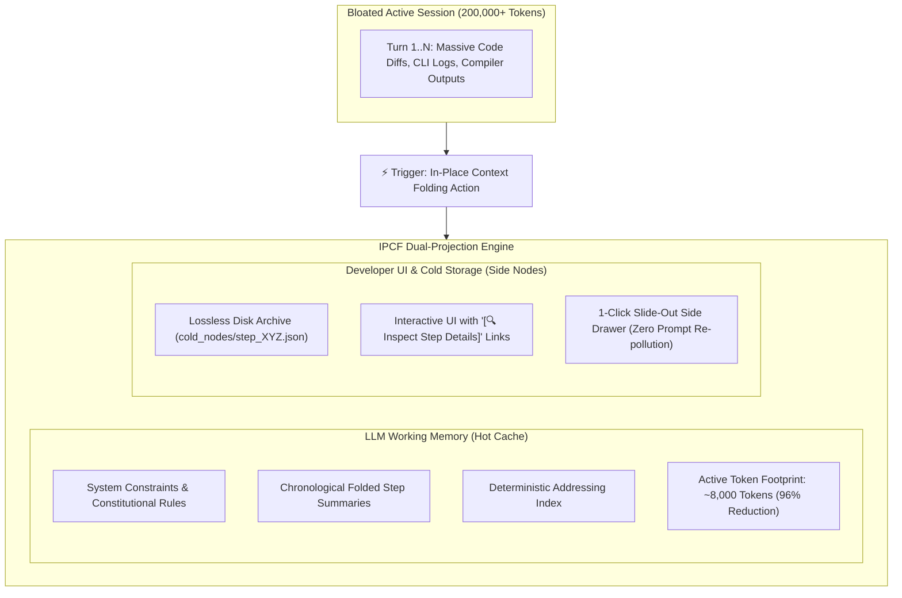

# ContextFold — In-Place Context Folding Protocol (IPCF-1.1)
### A Virtual Memory Paging Architecture for Long-Horizon Agentic LLM Conversations

[](https://opensource.org/licenses/MIT)
[]()
[]()

**Author:** Mustafa KILINC ([@mrblackman](https://github.com/mrblackman))  
**Version:** IPCF-1.1 (Normative Protocol Specification)  
**Document ID:** `RFC-IPCF-001`  
**Repository:** [github.com/mrblackman/ContextFold](https://github.com/mrblackman/ContextFold)  

---

> 💡 **Core Axioms:**  
> *"Fold changes what the model carries."*  
> *"Fork changes where the model continues."*  
> *"Don't make the AI carry what the machine can page."*  
> *"Don't ask the AI to remember what the machine can retrieve."*

---

## 🎯 1. Executive Summary

Modern AI coding assistants (such as Google Antigravity, Cursor, Windsurf, Claude Code, and GitHub Copilot) routinely hit 150,000–250,000+ tokens during extended engineering sessions. While Large Language Models advertise theoretical context windows of 1M+ tokens, empirical research (Stanford's *Lost in the Middle*, Chroma's *MECW*, RULER) establishes that **multi-step agentic reasoning degrades precipitously past 60,000–80,000 tokens ("Context Rot")**.

Today's developer is trapped in a painful dichotomy:
1. **Abandon the Session (New Chat):** Manually migrate to a new chat, forfeiting immediate visual continuity, scroll history, and cognitive scratchpad memory.
2. **Endure Context Degradation:** Remain in the bloated session, suffering from severe Time-To-First-Token (TTFT) latency, massive per-turn compute waste, and attention dilution loops.

**ContextFold (IPCF-1.1)** resolves this dilemma by adapting the proven computer science paradigm of **Virtual Memory Paging** to active LLM conversation runtimes. Unlike summarization tools that discard raw history, ContextFold operates an **In-Place Dual-Projection Architecture** that keeps the developer in the same session while decoupling active prompt context from archival disk storage.

### The Three Frequencies of Fidelity:
* **Storage Fidelity: Exact (Lossless):** 100% of raw conversation bytes, compiler outputs, and diffs are preserved permanently on disk (`cold_nodes/`), verified by SHA-256 integrity hashes.
* **Active Context Fidelity: Bounded & Selective:** Active LLM prompt context is compressed by ~96% (from 200k to ~8k tokens), containing strictly hot working memory and high-level architectural constraints.
* **Retrieval Fidelity: Exact:** Historical nodes are recalled on demand with byte-level original accuracy via a **Deterministic Historical Addressing Layer**.

---

## ⚖️ 2. The Four Invariants of ContextFold

Any compliant implementation of IPCF-1.1 MUST enforce four non-negotiable architectural invariants:

```text
┌────────────────────────────────────────────────────────────────────────┐
│                   THE 4 INVARIANTS OF IPCF-1.1                         │
├────────────────────────────┬───────────────────────────────────────────┤
│ 1. Lossless Storage        │ Folded turns are NEVER deleted from disk. │
│ 2. Deterministic Folding   │ Same turn + same policy = identical fold. │
│ 3. Exact Retrieval         │ Recalled data is SHA-256 verified bytes.  │
│ 4. Bounded Rehydration     │ Recalled nodes MUST evict after response. │
└────────────────────────────┴───────────────────────────────────────────┘
```

1. **Lossless Storage:** Moving data out of the active prompt does NOT mean discarding it. All historical turns exist permanently on disk.
2. **Deterministic Folding:** The transformation of raw tool logs into folded summary schema is strictly rule-bound and reproducible.
3. **Exact Retrieval:** Historical information is not re-hallucinated by an LLM; it is fetched directly from the verifiable cold storage file.
4. **Bounded Rehydration:** Recalled nodes exist in the prompt strictly for the turn in which they are inspected (`scope: single_turn`). They are **automatically evicted** on the subsequent turn, preventing context re-bloating (`8k -> 13k -> 8k`).

---

## 🏛️ 3. Architecture: The Dual-Projection Model

IPCF decouples the conversation representation seen by the **LLM** from the representation displayed to the **Developer**:



### Virtual Memory Operating System Analogy:

| Operating System Paradigm | ContextFold (IPCF-1.1) Equivalent |
| :--- | :--- |
| **Physical RAM** | Active LLM Prompt Context (Hot Cache: ~8,000 tokens) |
| **Disk Storage / Swap** | Lossless Cold Storage Archive (`cold_nodes/step_XYZ.json`) |
| **Page-Out (Swap Out)** | `fold_turn()`: Compress verbose logs into schema summary on disk |
| **Page-In (Swap In)** | `fetch_archived_node()`: On-demand single-turn rehydration |
| **Memory Address Bus** | **Deterministic Historical Addressing Layer** (Recall Index) |
| **Page Fault** | Agent needs past parameter not in hot context |
| **Page Eviction** | Automated pruning of hydrated node on the next turn |

---

## 🔍 4. The Breakthrough: Deterministic Historical Addressing Layer

### The Problem: *"How does the model know which step to fetch?"*
If a model needs to recall *"Which Docker port did we assign to Postgres 200 turns ago?"*, it cannot guess that this occurred at `step_id: 137`. A pure `step_id -> payload` key-value lookup fails when the key is forgotten.

### The Solution: Multi-Dimensional Recall Index
IPCF-1.1 specifies a **Deterministic Historical Addressing Layer** conforming to [`recall_index.schema.json`](schemas/recall_index.schema.json). During folding, machine parsing extracts an inverted index of structural entities:

```json
{
  "step_id": 137,
  "timestamp": "2026-09-25T11:42:00Z",
  "files": ["docker-compose.yml"],
  "symbols": ["PostgresDbContext"],
  "identifiers": ["5433", "POSTGRES_DB", "MonoFina_Dev"],
  "commands": ["docker compose up -d"],
  "errors": [],
  "entities": ["Database", "PostgreSQL", "DockerPort"],
  "content_sha256": "e3b0c44298fc1c149afbf4c8996fb92427ae41e4649b934ca495991b7852b855",
  "cold_node_ref": "cold_nodes/step_137.json"
}
```

### The Two-Stage Recall Interface:
Rather than relying on vague vector similarities, retrieval follows a two-stage deterministic pipeline:

```mermaid
flowchart TD
    LLM["LLM Agent Needs Historical Data"] -->|1. recall_archived_nodes(query='5433')| IDX["Deterministic Addressing Layer"]
    IDX -->|Returns Candidate Node: Step 137| LLM
    LLM -->|2. fetch_archived_node(step_id=137)| STORAGE["Cold Node Storage (Disk)"]
    STORAGE -->|Verifies SHA-256 & Hydrates Payload| TURN["Active Turn Prompt (+2.4k tokens)"]
    TURN -->|Generates Verified Answer| OUT["Agent Response"]
    OUT -->|Next Turn Starts: Eviction Enforced| PURGE["Hydrated Node Evicted (Prompt Returns to ~8k)"]
```

---

## 🧪 5. The 500-Turn Verification Scenario

To demonstrate the power of IPCF-1.1, consider a long-running 500-turn refactoring session:

* **Turn 37:** PostgreSQL container mapped to host port `5433`.
* **Turn 91:** MonoFina tenant isolation strategy finalized as schema-per-tenant (`t_mono`).
* **Turn 143:** Authentication cookie parsing bug resolved with custom middleware.
* **Turn 217:** Attempted in-memory cache rejected due to thread race conditions.
* **Turn 318:** Migration script `V12__TenantBilling.sql` applied.
* **Turn 447:** Final architectural validation completed.

```text
At Turn 490, developer asks:
"What was the exact port we used for PostgreSQL, and which migration applied the billing table?"

Without ContextFold:
- Context is at 230,000 tokens (18-second TTFT, $1.20 per prompt, high hallucination).

With ContextFold:
1. Active prompt is at 8,200 tokens.
2. Agent executes: recall_archived_nodes(identifiers=['PostgreSQL', 'port', 'billing'])
3. Index returns exact address: Step 37 (port 5433) and Step 318 (V12__TenantBilling.sql).
4. Agent executes: fetch_archived_node(step_id=37) and fetch_archived_node(step_id=318).
5. Exact verbatim configurations are verified via SHA-256, answer is rendered in 1.1s.
6. Step 37 and 318 payloads are evicted; active prompt returns to 8,200 tokens.
```

> **The Result:** The model does NOT carry 500 turns of baggage. But when needed, it retrieves the exact truth instantly.

---

## 📐 6. Formal Protocol Schemas (`schemas/`)

ContextFold provides formal JSON Schemas for tool authors and IDE vendors to implement interoperable context folding:

| Schema File | Purpose |
| :--- | :--- |
| **[`folded_step.schema.json`](schemas/folded_step.schema.json)** | Validates the lean, 2-line structured folded step summary retained in active prompt. |
| **[`cold_node.schema.json`](schemas/cold_node.schema.json)** | Validates the decoupled, raw historical payload persisted to disk. |
| **[`recall_index.schema.json`](schemas/recall_index.schema.json)** | Validates the multi-dimensional Deterministic Historical Addressing Layer. |
| **[`hydration_policy.schema.json`](schemas/hydration_policy.schema.json)** | Enforces bounded single-turn rehydration and automatic prompt eviction. |

---

## 🧭 7. The Architecture: Agent Context System (ACS)

ContextFold forms the core memory management tier of the **Agent Operating Architecture (AOA)**:

```text
                         AGENT OPERATING ARCHITECTURE (AOA)
                                         │
                 ┌───────────────────────┴───────────────────────┐
                 ▼                                               ▼
          [RUNTIME LAYER]                                [WORKSPACE LAYER]
                 │                                               │
        ┌────────┴────────┐                                      ▼
        ▼                 ▼                                [ACQUISITION]
  ContextFold        ContextFork                           git-grep-first
 (Memory Paging)   (Session Handoff)                       (Search Policy)
  • Same Session    • Cross Session                        • Zero token bloat
  • Hot/Cold split  • 6-part verifiable handoff            • Native git grep -u
  • Recall index    • Evidence & Git state                 • Anti-Select-String
  • Auto-eviction   • Role-based context shaping
```

---

## 🛡️ 8. Security & Red Team Considerations

1. **Secret Scrubbing Prior to Serialization:** Raw terminal streams frequently contain API tokens or database passwords. All payloads written to `cold_nodes/` MUST pass through regex redaction (`Bearer`, `sk_live_`, passwords).
2. **Ephemeral Memory Boundaries:** Hydrated historical nodes MUST NOT leak into the persistent session transcript. They are strictly single-turn scratchpad inputs.
3. **Integrity Hashes:** Every cold node file is referenced by its SHA-256 hash in the recall index to prevent on-disk payload tampering.

---

## 📜 9. License & Attribution

Released under the **[MIT License](LICENSE)**.

```bibtex
@misc{kilinc2026contextfold,
  author = {Mustafa KILINC (@mrblackman)},
  title = {ContextFold: In-Place Context Folding Specification (IPCF-1.1) - Virtual Memory Paging for Long-Horizon Agentic LLM Conversations},
  year = {2026},
  publisher = {GitHub},
  howpublished = {\url{https://github.com/mrblackman/ContextFold}}
}
```
