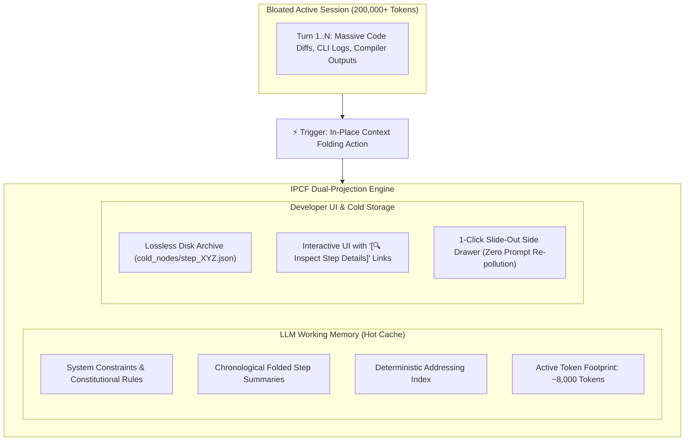
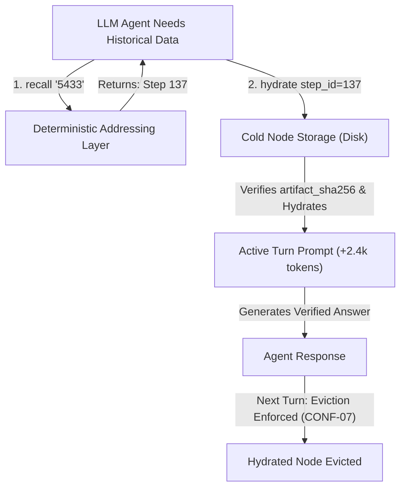

# ContextFold — In-Place Context Folding Protocol (IPCF-1.1)
### A Virtual Memory Paging Architecture for Long-Horizon Agentic LLM Sessions

> **IPCF** — *In-Place Context Folding Protocol*: a vendor-neutral open specification for lossless, deterministic in-session context paging for long-horizon AI agent conversations.

[](https://opensource.org/licenses/MIT)
[](schemas/)
[](contextfold.py)
[](CONFORMANCE.md)

**Author:** Mustafa KILINC ([@mrblackman](https://github.com/mrblackman))  
**Version:** IPCF-1.1 (Normative Protocol Specification)  
**Document ID:** `RFC-IPCF-001`  
**Repository:** [github.com/mrblackman/ContextFold](https://github.com/mrblackman/ContextFold)  

---

> 💡 **Core Axioms:**  
> *"Fold changes what the model carries."*  
> *"Fork changes where the model continues."*  
> *"Don't make the AI carry what the machine can page."*  
> *"Don't ask the AI to remember what the machine can retrieve."*

> ⚠️ **Specification Status: RFC Draft — Under Active Development**  
> This repository defines an open, vendor-neutral protocol. The accompanying `contextfold.py` is a **reference implementation** that demonstrates the method is buildable — it is not a production-ready tool. The conformance test suite (`CONFORMANCE.md`) defines the normative requirements any compliant implementation must satisfy. We welcome architectural feedback, peer review, and independent implementations.

---

## 🎯 1. Executive Summary

Modern AI coding assistants routinely reach 150,000–250,000+ tokens during extended engineering sessions. While Large Language Models advertise theoretical context windows of 1M+ tokens, empirical research (Stanford's *Lost in the Middle*, Chroma's *MECW*, RULER) establishes that **multi-step agentic reasoning degrades past 60,000–80,000 tokens ("Context Rot")**.

Today's developer is trapped in a painful dichotomy:
1. **Abandon the Session (New Chat):** Manually migrate, forfeiting visual continuity, scroll history, and cognitive scratchpad memory.
2. **Endure Context Degradation:** Remain in the bloated session, suffering severe Time-To-First-Token (TTFT) latency, per-turn compute waste, and attention dilution loops.

**ContextFold (IPCF-1.1)** resolves this dilemma by adapting the proven computer science paradigm of **Virtual Memory Paging** to active LLM conversation runtimes. Unlike summarization tools that discard raw history, ContextFold operates an **In-Place Dual-Projection Architecture** that keeps the developer in the same session while decoupling active prompt context from archival disk storage.

---

## ⚖️ 2. The Four Invariants of IPCF-1.1

Any compliant implementation MUST enforce four non-negotiable architectural invariants:

```text
┌────────────────────────────────────────────────────────────────────────┐
│                   THE 4 INVARIANTS OF IPCF-1.1                         │
├────────────────────────┬───────────────────────────────────────────────┤
│ 1. Lossless Storage    │ Folded turns are NEVER deleted from disk.     │
│ 2. Deterministic Fold  │ Same turn + same policy = identical fold.     │
│ 3. Exact Retrieval     │ Recalled data is SHA-256 verified bytes.      │
│ 4. Bounded Rehydration │ Recalled nodes MUST evict after response.     │
└────────────────────────┴───────────────────────────────────────────────┘
```

1. **Lossless Storage:** Moving data out of the active prompt does NOT mean discarding it. All historical turns exist permanently on disk.
2. **Deterministic Folding:** The transformation of raw tool logs into folded summary schema is strictly rule-bound and reproducible — same input always produces the same output.
3. **Exact Retrieval:** Historical information is not re-hallucinated; it is fetched directly from the verifiable cold storage file.
4. **Bounded Rehydration:** Recalled nodes exist in the prompt strictly for the turn in which they are inspected (`scope: single_turn`). They are automatically evicted on the subsequent turn, preventing context re-bloating (`8k → 13k → 8k`).

---

## 🏛️ 3. Architecture: The Dual-Projection Model

IPCF decouples the conversation representation seen by the **LLM** from the representation displayed to the **Developer**:



### Virtual Memory Analogy

| Operating System Paradigm | ContextFold (IPCF-1.1) Equivalent |
| :--- | :--- |
| **Physical RAM** | Active LLM Prompt Context (Hot Cache: ~8,000 tokens) |
| **Disk Storage / Swap** | Lossless Cold Storage Archive (`cold_nodes/step_XYZ.json`) |
| **Page-Out (Swap Out)** | `fold_turn()`: Compress verbose logs into schema summary on disk |
| **Page-In (Swap In)** | `fetch_archived_node()`: On-demand single-turn rehydration |
| **Memory Address Bus** | Deterministic Historical Addressing Layer (Recall Index) |
| **Page Fault** | Agent needs past parameter not in hot context |
| **Page Eviction** | Automated pruning of hydrated node on the next turn |

---

## 🔍 4. Deterministic Historical Addressing Layer

### The Problem: *"How does the model know which step to fetch?"*
If a model needs to recall *"Which Docker port did we assign to Postgres 200 turns ago?"*, it cannot guess that this occurred at `step_id: 137`. A pure `step_id → payload` key-value lookup fails when the key is forgotten.

### The Solution: Multi-Dimensional Recall Index
IPCF-1.1 specifies a **Deterministic Historical Addressing Layer** conforming to [`recall_index.schema.json`](schemas/recall_index.schema.json). During folding, machine parsing extracts an inverted index of structural entities:

```json
{
  "step_id": 137,
  "folded_at": "2026-09-25T11:42:00Z",
  "identifiers": ["5433", "postgres_db", "monofina_dev"],
  "payload_sha256":    "a3f2...c91b",
  "projection_sha256": "7e4d...82fa",
  "artifact_sha256":   "b901...44cc"
}
```

### Two-Stage Recall



---

## 📏 5. Three Hash Identities (CONFORMANCE.md §2)

Every folded artifact carries three distinct hash identities, each answering a different question:

```text
                ContextFold Identity Model
                          │
         ┌────────────────┬────────────────┐
         │                │                │
   payload_sha256   projection_sha256   artifact_sha256
         │                │                │
   "What arrived?"  "What was produced?"  "How is it stored?"
         │                │                │
      CONF-02          CONF-11           CONF-09
    Round-Trip       Deterministic        Tamper
                       Replay            Detection
```

| Identity | Computed From | Changes When? |
| :--- | :--- | :--- |
| `payload_sha256` | Raw source content (UTF-8) | Never — immutable |
| `projection_sha256` | Canonical fields in fixed order (step_id, normalized_content, sorted identifiers) | Projection algorithm changes |
| `artifact_sha256` | Full serialized cold node file | Serialization format changes |

---

## 🧪 6. The 500-Turn Verification Scenario

To demonstrate IPCF-1.1, consider a long-running 500-turn refactoring session:

* **Turn 37:** PostgreSQL container mapped to host port `5433`.
* **Turn 91:** Port switched to `5434` (conflict resolution).
* **Turn 137:** Port reverted to `5433`.
* **Turn 318:** Migration script `V12__TenantBilling.sql` applied.

```text
At Turn 490, developer asks:
"What port are we using for PostgreSQL, and which migration applied the billing table?"

Without ContextFold:
- Context is at 230,000 tokens. Severe attention dilution.

With ContextFold:
1. Active prompt is at 8,200 tokens.
2. Agent: recall_archived_nodes(query='PostgreSQL port')
3. Index returns: Step 137 (latest), Step 91, Step 37 — chronologically ranked.
4. Agent: hydrate(step_id=137) and hydrate(step_id=318)
5. artifact_sha256 verified. Exact configurations rendered.
6. Both nodes evicted. Active prompt returns to 8,200 tokens.
```

> **The key insight:** The model does NOT carry 500 turns of baggage. But when needed, it retrieves the verified truth instantly — without hallucination.

---

## 💻 7. Reference Implementation (`contextfold.py`)

ContextFold provides an official reference CLI written in pure Python 3.10+ standard library, demonstrating that the IPCF method is buildable with zero external dependencies.

> **Scope Note:** `contextfold.py` is a **reference implementation** — its purpose is to demonstrate protocol feasibility and serve as a specification artifact, not to be production-hardened. Independent implementations by IDE vendors and agent harness teams are explicitly encouraged.

```bash
# Archive a turn into cold storage
python contextfold.py fold 42 "PostgreSQL configured on port 5433"

# Search archived nodes
python contextfold.py recall "PostgreSQL port"

# Hydrate a cold node into active prompt (SHA-256 verified)
python contextfold.py hydrate 42

# Evict after LLM response (CONF-07)
python contextfold.py evict 42

# Show session status
python contextfold.py status

# Run integrity check on all cold nodes
python contextfold.py validate

# Run 500-turn simulation
python contextfold.py demo
```

---

## 📐 8. Formal Protocol Schemas (`schemas/`)

| Schema File | Purpose |
| :--- | :--- |
| **[`cold_node.schema.json`](schemas/cold_node.schema.json)** | Validates the cold storage payload including all three hash identities. |
| **[`recall_index.schema.json`](schemas/recall_index.schema.json)** | Validates the Deterministic Historical Addressing Layer (dict keyed by step_id). |
| **[`folded_step.schema.json`](schemas/folded_step.schema.json)** | Validates the lean structured folded step summary retained in active prompt. |
| **[`hydration_policy.schema.json`](schemas/hydration_policy.schema.json)** | Enforces bounded single-turn rehydration and automatic prompt eviction. |

---

## 🧭 9. The Architecture: Agent Context System (ACS)

ContextFold forms the memory management tier of the **Agent Context System**:

```text
                         AGENT CONTEXT SYSTEM (ACS)
                                         │
                 ┌───────────────────────┴───────────────────────┐
                 ▼                                               ▼
          [RUNTIME LAYER]                                [WORKSPACE LAYER]
                 │                                               │
        ┌────────┴────────┐                                      ▼
        ▼                 ▼                                [ACQUISITION]
  ContextFold        ContextFork                           git-grep-first
 (Memory Paging)   (Session Handoff)                       (Search Policy)
  • Same Session    • Cross Session                        • Zero token bloat
  • Hot/Cold split  • 6-part verifiable handoff            • Native git grep
  • Recall index    • Evidence & Git state                 • Anti-Select-String
  • Auto-eviction   • Role-based context shaping
```

---

## 🛡️ 10. Security Design Notes

1. **Secret Scrubbing Prior to Serialization:** Raw terminal streams may contain API tokens or database passwords. All payloads written to `cold_nodes/` MUST pass through regex redaction before setting `sanitized: true`. The reference implementation sets `sanitized: false` to make this explicit — production implementations MUST implement this step.
2. **Ephemeral Memory Boundaries:** Hydrated historical nodes MUST NOT leak into the persistent session transcript. They are strictly single-turn scratchpad inputs.
3. **Integrity Hashes:** Every cold node is referenced by its `artifact_sha256` in the recall index. Any on-disk tampering is detected on the next `validate` or `hydrate` call.

---

## 🧪 11. Conformance & Verification (`CONFORMANCE.md`)

To guarantee that ContextFold engines operate deterministically, the specification defines **12 Normative Conformance Requirements** in **[CONFORMANCE.md](CONFORMANCE.md)**:

* **CONF-01 – CONF-03:** Lossless storage, SHA-256 round-trip integrity, and deterministic indexing.
* **CONF-04:** Temporal disambiguation (chronological resolution when configurations evolve across turns).
* **CONF-05 – CONF-07:** Exact verbatim retrieval, bounded rehydration caps, and single-turn prompt eviction.
* **CONF-08 – CONF-10:** UI dual-projection isolation, tamper detection, and explicit failure modes.
* **CONF-11 – CONF-12:** Deterministic replay (projection_sha256) and atomic fold integrity.

Implementations must satisfy all 12 requirements to claim **`IPCF-1.1 Compliant`** status.

---

## 🗺️ 12. Relationship to Prior & Related Work

| Prior Work | What it does | What IPCF adds |
| :--- | :--- | :--- |
| **Claude Code `/compact`** | Summarizes the session in-place, replacing old messages | IPCF archives to external cold storage — raw history is preserved and verifiable; nothing is destructively overwritten |
| **MemGPT / Letta** | Hierarchical memory with main context + archival memory paging | IPCF targets *session-level* context in IDE tooling rather than autonomous agent memory; adds deterministic SHA-256 verification and a normative conformance test suite |
| **LangGraph Checkpoints** | Graph state snapshots for resumability | IPCF is LLM-native, IDE-level, and targets developer workflow; it captures *intent* (summaries) alongside *state* (hash-verified cold nodes), rather than agent graph internals |
| **Sliding Window Attention** | Model-level truncation of old tokens | IPCF is application-level and lossless — discarded content is preserved and retrievable; the model is never unilaterally truncated |
| **ContextFork (IPSF-1.2)** | Session handoff — transfers context to a new session | IPCF keeps the developer in the *same* session; ContextFold and ContextFork are complementary layers of the ACS stack |

**The IPCF contribution:** The combination of (1) lossless cold storage with SHA-256 verification, (2) deterministic historical addressing enabling exact retrieval without vector similarity, (3) bounded single-turn rehydration preventing context re-bloating, and (4) a vendor-neutral open schema with a formal conformance test suite.

---

## 📜 13. License & Attribution

Released under the **[MIT License](LICENSE)**.

```bibtex
@misc{kilinc2026contextfold,
  author    = {Mustafa KILINC (@mrblackman)},
  title     = {ContextFold: In-Place Context Folding Protocol (IPCF-1.1)},
  year      = {2026},
  publisher = {GitHub},
  howpublished = {\url{https://github.com/mrblackman/ContextFold}}
}
```
