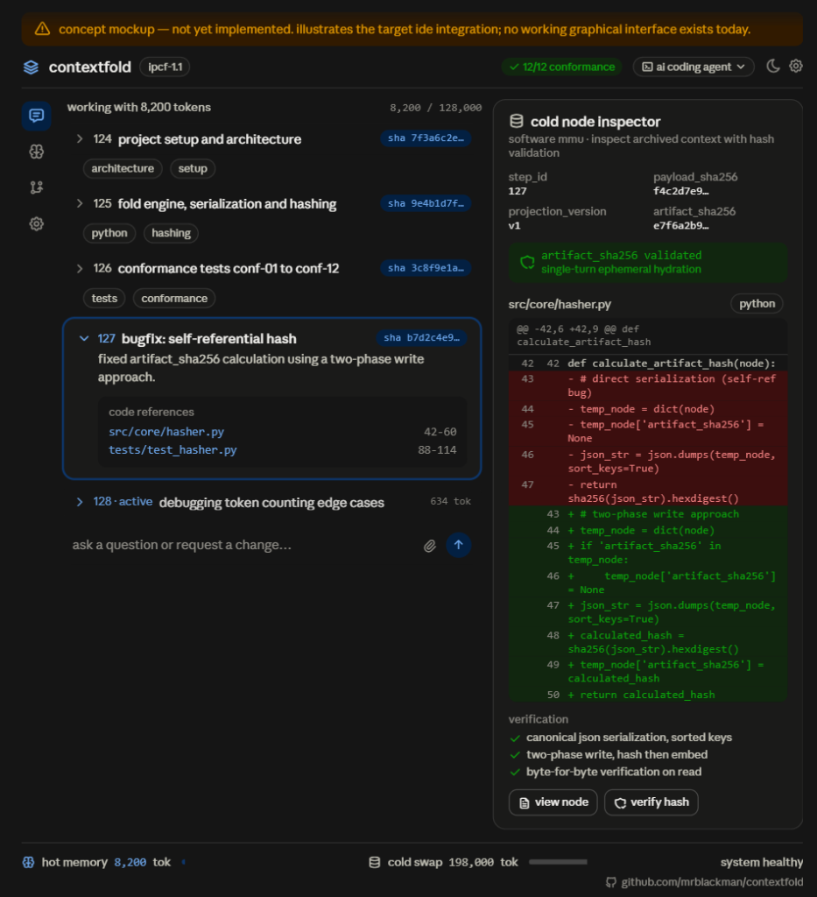
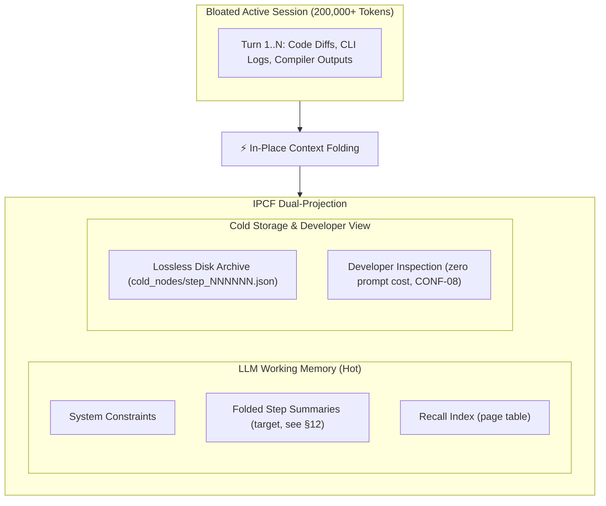
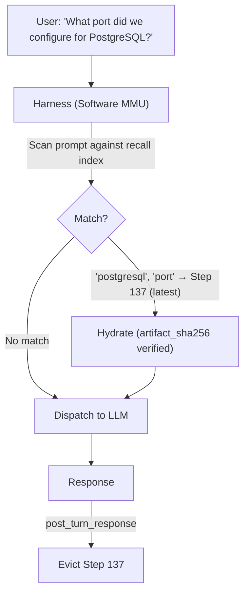

# ContextFold — In-Place Context Folding Protocol (IPCF-1.1)
### A Virtual Memory Paging Architecture for Long-Horizon Agentic LLM Sessions

> **IPCF** — *In-Place Context Folding Protocol*: a vendor-neutral open specification for lossless, deterministic in-session context paging for long-horizon AI agent conversations.

[](https://opensource.org/licenses/MIT)
[](schemas/)
[](contextfold.py)
[](CONFORMANCE.md)

**Author:** Mustafa KILINC ([@mrblackman](https://github.com/mrblackman))  
**Version:** IPCF-1.1 (Normative Protocol Specification)  
**Document ID:** `RFC-IPCF-001`  
**Repository:** [github.com/mrblackman/ContextFold](https://github.com/mrblackman/ContextFold)  

---

> 💡 **Core Axioms:**  
> *"Fold changes what the model carries."*  
> *"Fork changes where the model continues."*  
> *"Don't make the AI carry what the machine can page."*  
> *"Don't ask the AI to remember what the machine can retrieve."*

> ⚠️ **Specification Status: RFC Draft — Under Active Development**  
> This repository defines an open, vendor-neutral protocol. The accompanying `contextfold.py` is a **reference implementation** that demonstrates the method is buildable — it is not a production-ready tool and it is **not yet integrated with any agent harness or IDE**. The conformance suite (`CONFORMANCE.md`) defines the requirements a compliant implementation must satisfy. See **[§12 Implementation Status & Goals](#-12-implementation-status--goals)** for exactly what is implemented today and what is still a goal. Architectural feedback, peer review, and independent implementations are welcome.

---

## 🔌 0. Runtime Assumptions & Integration Surface

IPCF is designed for **active Agent Harnesses and IDE Runtimes** (such as Google Antigravity, Claude Code, Cursor, Windsurf, Aider, and custom agent loops) that programmatically assemble the LLM's message array on every conversational turn.

> ⚠️ **Non-Applicability to Passive Web Chats:**  
> IPCF **cannot** run inside standard consumer web chat interfaces (such as vanilla ChatGPT or Claude.ai web UIs) where the platform owns transcript persistence and the client has no control over the prompt.

### Required Harness Capabilities
To implement IPCF, a hosting agent harness MUST support:
1. **Dynamic Context Window Assembly:** injecting ephemeral messages into the prompt payload *before* dispatching to the LLM.
2. **Turn-Level Lifecycle Hooks:**
   - `pre_turn_dispatch`: scan the incoming user prompt against `recall_index.json` and hydrate matching cold nodes.
   - `post_turn_response`: evict hydrated nodes after the response (`CONF-07`), returning the prompt to its baseline.

> **Reference implementation note:** `contextfold.py` exposes these operations as CLI commands (`scan`, `hydrate`, `evict`). The full turn lifecycle is exercised by a simulated harness (`MockHarnessContext`) in the conformance test suite; no real harness integration ships yet (see §12).

> 🎨 **Concept mockup — not a screenshot.** The image below illustrates the *target* IDE integration. No graphical implementation exists; `contextfold.py` is a terminal-only CLI.



---

## 🎯 1. Executive Summary

Modern AI coding assistants routinely reach 150,000–250,000+ tokens during extended engineering sessions. While models advertise context windows of 1M+ tokens, published research (*Lost in the Middle*, RULER, and related long-context evaluations) reports that reasoning quality degrades well before the advertised limit ("context rot").

Developers are left with two poor options:
1. **Abandon the session (new chat):** losing continuity, scroll history, and working memory.
2. **Endure context degradation:** staying in a bloated session with rising latency, per-turn compute cost, and attention dilution.

**ContextFold (IPCF-1.1)** adapts **virtual memory paging** to LLM conversation runtimes. Instead of discarding history through summarization, IPCF moves verbose turns to verifiable cold storage on disk and pages them back into the prompt only for the turn in which they are needed.

---

## ⚖️ 2. The Four Invariants of IPCF-1.1

Any compliant implementation MUST enforce four invariants:

```text
┌────────────────────────────────────────────────────────────────────────┐
│                   THE 4 INVARIANTS OF IPCF-1.1                         │
├────────────────────────┬───────────────────────────────────────────────┤
│ 1. Lossless Storage    │ Folded turns are NEVER deleted from disk.     │
│ 2. Deterministic Fold  │ Same turn + same policy = identical fold.     │
│ 3. Exact Retrieval     │ Recalled data is SHA-256 verified bytes.      │
│ 4. Bounded Rehydration │ Recalled nodes MUST evict after response.     │
└────────────────────────┴───────────────────────────────────────────────┘
```

1. **Lossless Storage:** moving data out of the prompt never discards it; the raw payload stays on disk (`CONF-01`, `CONF-02`).
2. **Deterministic Folding:** given the same raw payload, summary and policy, the fold engine produces a byte-identical projection (`projection_sha256`, `CONF-11`).
3. **Exact Retrieval:** recalled content is read from disk and hash-verified, never regenerated (`CONF-05`, `CONF-09`).
4. **Bounded Rehydration:** hydrated nodes are capped per call and per turn, and exist in the prompt only for the current turn (`scope: single_turn`, `CONF-06`, `CONF-07`).

### What is Deterministic, and What is Not?

* **Semantic / non-deterministic input:** writing a human-readable summary of a verbose log is a semantic task (performed by an LLM or an engineer). IPCF does not claim natural-language summarization is deterministic.
* **Deterministic protocol:** once the summary and raw payload are handed to the fold engine, everything after that — identifier extraction, canonical projection, indexing, the three SHA-256 identities, persistence, scanning and hydration — is deterministic and reproducible (`CONF-03`, `CONF-11`).

---

## 🏛️ 3. Architecture: The Dual-Projection Model

IPCF separates what the **LLM** carries from what the **developer** can inspect:


```mermaid
flowchart TD
    subgraph RawSession["Bloated Active Session (200,000+ Tokens)"]
        direction TB
        R1["Turn 1..N: Code Diffs, CLI Logs, Compiler Outputs"]
    end

    Action["⚡ In-Place Context Folding"]
    RawSession --> Action

    subgraph DualProjection["IPCF Dual-Projection"]
        direction LR

        subgraph HotLayer["LLM Working Memory (Hot)"]
            direction TB
            H1["System Constraints"]
            H2["Folded Step Summaries (target, see §12)"]
            H3["Recall Index (page table)"]
        end

        subgraph ColdLayer["Cold Storage & Developer View"]
            direction TB
            C1["Lossless Disk Archive (cold_nodes/step_NNNNNN.json)"]
            C2["Developer Inspection (zero prompt cost, CONF-08)"]
        end
    end

    Action --> DualProjection
```

### Virtual Memory Analogy

| Operating System Paradigm | ContextFold (IPCF-1.1) Equivalent | Reference CLI |
| :--- | :--- | :--- |
| **Physical RAM** | Active LLM prompt context | — |
| **Disk / Swap** | Lossless cold storage (`.contextfold/cold_nodes/`) | — |
| **Page Table** | `recall_index.json` | — |
| **Page-Out (Swap Out)** | Fold a turn into cold storage and index it | `fold` |
| **MMU** | Passive prompt scan against the recall index | `scan` |
| **Page-In (Swap In)** | Hash-verified single-turn rehydration | `hydrate` |
| **Page Eviction** | Removal of hydrated content after the response | `evict` |

---

## 🔍 4. Deterministic Historical Addressing Layer

### Why Pull-Based Recall Fails
If an architecture expects the LLM to realize *"I don't remember the database port from 200 turns ago, so I'll call a recall tool"*, it fails in practice: models rarely detect their own missing knowledge and tend to produce a plausible answer instead of asking.

### Push-Based Passive Recall (The Software MMU Pattern)
In an operating system, the MMU traps an access to a missing page and loads it transparently; the process never asks. IPCF applies the same idea (`CONF-13`, candidate requirement):
1. **Passive interception:** before each turn, the harness scans the user prompt against the identifiers, files and errors indexed in `recall_index.json`.
2. **Transparent page-in:** matching cold nodes are hydrated into the prompt *before* the model generates a token.
3. **No meta-cognitive burden:** the model does not need to know it had forgotten anything.
4. **Single-turn eviction:** after the response, hydrated nodes are evicted and the prompt returns to its baseline.


```mermaid
flowchart TD
    USER["User: 'What port did we configure for PostgreSQL?'"] --> HARNESS["Harness (Software MMU)"]
    HARNESS -->|"Scan prompt against recall index"| MATCH{"Match?"}
    MATCH -->|"'postgresql', 'port' → Step 137 (latest)"| HYDRATE["Hydrate (artifact_sha256 verified)"]
    MATCH -->|"No match"| DISPATCH["Dispatch to LLM"]
    HYDRATE --> DISPATCH
    DISPATCH --> OUT["Response"]
    OUT -->|"post_turn_response"| PURGE["Evict Step 137"]
```

### Multi-Intent Selection and Turn Budget
A single prompt can contain several intents (e.g. *"which port … and which migration …"*). The reference `scan` selects nodes with a **Residual Greedy Set Cover (RGSC)**:
* repeatedly pick the node that covers the most still-unanswered query terms; ties go to the most recent step (`step_id DESC`);
* stop when no node covers a remaining term — nodes that add nothing new (older duplicates, incidental single-word matches) are never hydrated;
* respect a per-turn token budget (`max_rehydration_tokens_per_turn`, default 3500) in addition to the per-call cap (`max_rehydration_tokens_per_call`, default 3000);
* **Intent ownership:** if the most recent node for an intent does not fit the remaining budget, that intent is dropped for the turn — an older, superseded node is **never** hydrated in its place. A tight budget can produce *missing* context, never *stale* context.

### Recall Index Entry (excerpt)
Each folded step is indexed per [`recall_index.schema.json`](schemas/recall_index.schema.json). Excerpt of the entry produced by the demo for step 137 (hashes shortened):

```json
{
  "step_id": 137,
  "projection_version": "ipcf-projection-v2",
  "summary": "PostgreSQL port 5434 reverted back to Port 5433",
  "file_path": ".contextfold/cold_nodes/step_000137.json",
  "identifiers": ["5433", "5434", "config", "env", "port", "postgresql", "restored", "reverted", "sed"],
  "payload_sha256":    "…",
  "projection_sha256": "…",
  "artifact_sha256":   "…"
}
```

### Keyword-Based vs. Semantic Recall
* **Reference choice:** `contextfold.py` uses exact-term matching after Unicode NFC normalization and case folding (including Turkish dotted/dotless *i*). This keeps the implementation dependency-free (Python standard library only) and fully deterministic.
* **Trade-off:** exact terms do not match synonyms, paraphrases, prefixes (`postgres` vs `postgresql`) or inflected forms.
* **Extension path:** production harnesses may add embeddings or hybrid BM25 + dense retrieval on top of the index, without changing the cold storage or hash verification contracts.

---

## 📏 5. Three Hash Identities (CONFORMANCE.md §2)

```text
                ContextFold Identity Model
                          │
         ┌────────────────┬────────────────┐
         │                │                │
   payload_sha256   projection_sha256   artifact_sha256
         │                │                │
   "What arrived?"  "What was produced?"  "How is it stored?"
         │                │                │
      CONF-02          CONF-11           CONF-09
    Round-Trip       Deterministic        Tamper
                       Replay            Detection
```

| Identity | Computed From | Changes When? |
| :--- | :--- | :--- |
| `payload_sha256` | Raw source content (UTF-8) | Never — immutable |
| `projection_sha256` | Eight canonical fields in fixed order: projection version, step id, normalized content, sorted identifiers / files / commands / errors, and the hash of the active hydration policy | The projection algorithm or the active policy changes |
| `artifact_sha256` | Canonical serialization of the cold node file (excluding this field) | Any byte of the stored node changes |

---

## 🧪 6. The 500-Turn Verification Scenario

The demo (`python contextfold.py demo`) folds eight representative turns of a long refactoring session:

| Turn | Event |
| :--- | :--- |
| 37 | PostgreSQL configured on port `5433` |
| 91 | Port switched to `5434` (conflict resolution) |
| 137 | Port reverted back to `5433` |
| 200 | Authentication middleware refactored |
| 318 | Migration `V12__TenantBilling.sql` applied |
| 342 | Migration V12 rolled back (deadlock in billing table) |
| 447 | Migration V12 patched and re-applied |
| 499 | Final review: services healthy |

```text
Developer asks:
"What port are we using for PostgreSQL, and which migration applied the billing table?"

Reference scan (reproducible with the demo and the test suite):
  → hydrate Steps 342, 137, 447
  → not hydrated: 91, 37 (superseded port states), 318, 499 (add no new terms)

Illustrative harness flow (token figures are illustrative, not measured):
  1. Baseline prompt ≈ 8k tokens.
  2. pre_turn_dispatch hydrates the selected nodes (hash-verified, within the turn budget).
  3. The model answers from verified history.
  4. post_turn_response evicts them; the prompt returns to baseline.
```

> **Key idea:** the model does not carry 500 turns of history — but when a turn needs it, the verified record is paged in.

---

## 💻 7. Reference Implementation (`contextfold.py`)

Pure Python 3.10+, standard library only.

> **Scope:** a reference implementation that demonstrates protocol feasibility and serves as a specification artifact — not a production-hardened tool.

```bash
# Fold a turn into cold storage (raw payload from a file; summary is required)
python contextfold.py fold 42 "PostgreSQL configured on port 5433" --file turn42.log

# Passive MMU scan of a prompt (multi-intent, budget-aware)
python contextfold.py scan "What port did we set for PostgreSQL?"

# Explicit recall with coverage tiering and chronological labels
python contextfold.py recall "PostgreSQL port"

# Hash-verified hydration (bounded by the per-call cap)
python contextfold.py hydrate 42

# Record eviction after the response (CONF-07)
python contextfold.py evict 42

# Session summary
python contextfold.py status

# Integrity check: hashes, orphaned nodes, broken references, path containment
python contextfold.py validate

# Scenario from §6
python contextfold.py demo
```

Run the conformance suite:

```bash
python -m unittest discover -s tests -v
```

---

## 📐 8. Formal Protocol Schemas (`schemas/`)

| Schema File | Purpose | Reference implementation |
| :--- | :--- | :--- |
| **[`cold_node.schema.json`](schemas/cold_node.schema.json)** | Cold storage payload, including the three hash identities | Produced by `fold` |
| **[`recall_index.schema.json`](schemas/recall_index.schema.json)** | Recall index (page table), keyed by step id | Produced by `fold` |
| **[`hydration_policy.schema.json`](schemas/hydration_policy.schema.json)** | Per-call and per-turn caps, single-turn scope, eviction trigger | Read by `scan` / `hydrate` |
| **[`folded_step.schema.json`](schemas/folded_step.schema.json)** | Compact folded-step summary kept in the active prompt | **Specified only — not yet produced** (see §12) |

> The reference CLI does not validate files against these JSON Schemas at runtime; `validate` checks hashes, references and path containment.

---

## 🧭 9. Agent Context System (ACS) — Architectural Vision

ContextFold is intended as the memory tier of a broader **Agent Context System**:

```text
                         AGENT CONTEXT SYSTEM (ACS)
                                    │
                 ┌──────────────────┴──────────────────┐
                 ▼                                     ▼
          [RUNTIME LAYER]                      [WORKSPACE LAYER]
                 │                                     │
        ┌────────┴────────┐                            ▼
        ▼                 ▼                     Search / acquisition
  ContextFold        ContextFork                policy (concept)
 (memory paging)   (session handoff)
  • same session    • cross session
  • hot/cold split  • verifiable handoff
  • recall index
  • auto-eviction
```

* **ContextFork** (IPSF-1.2) is a separate open specification: [github.com/mrblackman/ContextFork](https://github.com/mrblackman/ContextFork).
* The workspace layer is a design direction, not a published component.

---

## 🛡️ 10. Security Design Notes

1. **Integrity:** every cold node is referenced by its `artifact_sha256`; on-disk tampering is detected by `hydrate` and `validate` (`CONF-09`).
2. **Path containment:** the stored `file_path` is never trusted. The engine derives the canonical path from the step id and rejects traversal, absolute paths, sibling-prefix directories and symlink escapes — independently of the `integrity_verification` policy flag (`CONF-12`).
3. **Ephemeral boundaries:** hydrated nodes MUST NOT leak into the persistent session transcript; they are single-turn inputs.
4. **Secret scrubbing (required for production, not implemented):** raw terminal output may contain credentials. Production implementations MUST redact payloads before writing cold nodes and then set `sanitized: true`. The reference implementation performs no redaction and always writes `sanitized: false` to make this explicit.

---

## 🧪 11. Conformance & Verification (`CONFORMANCE.md`)

The specification defines **13 conformance requirements** (12 normative core + 1 candidate), verified by **16 automated tests**:

* **CONF-01 – CONF-03:** lossless storage, SHA-256 round-trip integrity, deterministic indexing.
* **CONF-04:** temporal disambiguation in recall (coverage tiering, `step_id DESC`, exact-term matching).
* **CONF-05 – CONF-07:** exact retrieval, bounded rehydration (per-call and per-turn), single-turn eviction.
* **CONF-08 – CONF-10:** developer-view isolation, tamper detection, explicit failure modes.
* **CONF-11 – CONF-12:** deterministic replay (`projection_sha256` v2), inconsistent-state detection and path containment.
* **CONF-13 (candidate):** passive recall interception (Software MMU), multi-intent selection with intent ownership, Unicode normalization.

An implementation must pass the suite to claim **`IPCF-1.1 Compliant`** status.

---

## 🗺️ 12. Implementation Status & Goals

### Implemented in the reference CLI
* Two-phase atomic fold to cold storage with the three hash identities.
* Recall index, exact-term matching with Unicode / Turkish case folding.
* Recall with coverage tiering and chronological labels.
* Passive MMU scan with multi-intent selection (RGSC), per-turn budget and intent ownership.
* Hash-verified hydration with per-call cap; eviction logging.
* Integrity validation: tamper detection, orphaned nodes, broken references, path containment.
* Conformance suite: 13 requirements, 16 tests, simulated harness lifecycle.

### Goals (not yet implemented)
* **Hot projection:** producing the folded-step summary defined by `folded_step.schema.json` — the compact record that replaces a folded turn in the active prompt.
* **Real harness integration:** hooking `pre_turn_dispatch` / `post_turn_response` into an actual agent harness or IDE (e.g. via an MCP server). Today the lifecycle is only simulated in tests.
* **IDE user interface:** the inspector shown in the concept mockup.
* **Secret scrubbing** before cold storage writes (`sanitized: true`).
* **Runtime JSON Schema validation** of generated artifacts.
* **Accurate token accounting:** the reference uses a ~4 characters/token heuristic.
* **Repair protocol:** IPCF-1.1 requires detecting and refusing inconsistent state, not repairing it; automatic repair is a possible future extension.
* **Richer matching:** prefix, morphological (e.g. Turkish suffixes) or semantic matching, and adaptive per-turn budgets.

---

## 📚 13. Relationship to Prior & Related Work

| Prior Work | What it does | What IPCF adds |
| :--- | :--- | :--- |
| **Claude Code `/compact`** | Summarizes the session in place, replacing old messages | Raw history is archived to verifiable cold storage instead of being overwritten |
| **MemGPT / Letta** | Hierarchical agent memory with archival paging | Targets session-level context in developer tooling; adds SHA-256 verification and a conformance suite |
| **LangGraph checkpoints** | Graph state snapshots for resumability | Focuses on conversational context paging rather than agent graph state |
| **Sliding-window attention** | Model-level truncation of old tokens | Application-level and lossless — nothing is unilaterally discarded |
| **ContextFork (IPSF-1.2)** | Session handoff to a new session | Complementary: ContextFold keeps the developer in the *same* session |

**The IPCF contribution:** (1) lossless cold storage with SHA-256 verification, (2) deterministic addressing for exact retrieval without vector similarity, (3) bounded single-turn rehydration, (4) push-based passive recall (Software MMU), and (5) an open schema set with a formal conformance suite.

---

## 📜 14. License & Attribution

Released under the **[MIT License](LICENSE)**.

```bibtex
@misc{kilinc2026contextfold,
  author    = {Mustafa KILINC (@mrblackman)},
  title     = {ContextFold: In-Place Context Folding Protocol (IPCF-1.1)},
  year      = {2026},
  publisher = {GitHub},
  howpublished = {\url{https://github.com/mrblackman/ContextFold}}
}
```
